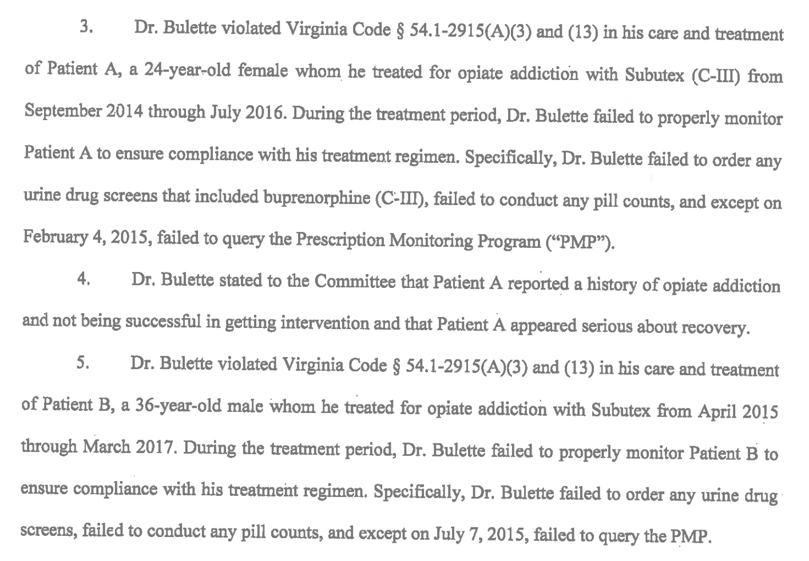

##From the License Lookup for Dr. John Bulette, Nassawadox, VA

License Number	0101051010
Occupation	Medicine & Surgery
Name	JOHN L BULETTE
Address	Nassawadox, VA 23413
Initial License Date	07/01/1994
Expire Date	11/30/2020
License Status	Probation - Current Active

##From Public Disciplinary Proceedings (Excerpt)

BEFORE THE VIRGINIA BOARD OF MEDICINE
IN RE: JOHN LAWRENCE BULETTE, M.D.
License Number 0101-051010
Case Numbers 175338, 179170
ORDER
JURISDICTION AND PROCEDURAL HISTORY
Pursuant to Virginia Code $5 2.2-4019 and 54.1-2400(10), a Special Conference Committee
Committee) of the Virginia Board of Medicine "Board") held an informal conference on January 30, 2019, in Henrico County, Virginia, to inquire into evidence that John Lawrence Bulette, M.D, may have violated certain laws and regulations governing the practice of medicine and surgery in the Commonwealth of Virginia.

Upon consideration of the evidence, the Board adopts the following Findings of Fact and
Conclusions of Law and issues the Order contained herein.
FINDINGS OF FACT AND CONCLUSIONS OF LAW
John Lawrence Bulette, M.D, was issued License Number 0101-051010 to practice
medicine and surgery on July 1,1994, which is scheduled to expire on November 30, 2020. At all times relevant to the findings contained herein, said license was current and active

Dr. Bulette's prior Board history includes the following:
By Order entered April 1, 2008,the Board required Dr. Bulette to complete continuing medical education in the subject of treatment of psychotic disorders. This action was based on findings that Dr. Bulette prescribed Adderall (C-ID to a patient who had a long history of psychotic disorder, substance abuse, and incarcerations although agitated states and drug abuse were listed contraindications for use of Adderall and that Dr. Bulette continued to prescribe Adderall despite the patient demonstrating psychotic symptomology and relational problems and aggression which required multiple hospitalizations and incarcerations.

By Order entered June 8, 2009 the Board prohibited Dr. Bulette from prescribing methadone (C-II) to patients until and unless he is qualified and registered to dispense narcotic drags for maintenance or detoxification treatment in compliance with federal law. This section was based on findings that Dr. Bulette prescribed methadone to ten (10) patients for maintenance or detoxification treatment for periods of up to a year each, though he was not qualified or registered to dispense narcotic drugs for such treatment, as required by federal law and regulation.

Dr. Bulette violated Virginia Code $ 54.1-2915(A)3) and (13) in his care and treatment of Patient A, a 24-year-old female whom be treated for opiate addiction with Subutex (C-II) from September 2014 through July 2016. During the treatment period, Dr. Bulette failed to properly monitor Patient A to ensure compliance with his treatment regimen. Specifically, Dr. Bulette failed to order any urine drug screens that included buprenorphine (C-IID, failed to conduct any pill counts, and except on February 4, 2015, failed to query the Prescription Monitoring Program C"PMP")

Dr. Bulette stated to the Committee that Patient A reported a history of opiate addiction and not being successful in getting intervention and that Patient A appeared serious about recovery.

Dr. Bulette violated Virginia Code $ $4.1-2915(A)3) and (13) in his care and treatment of Patient B, a 36-year-old male whom he treated for opiate addiction with Subutex from April 201 through March 2017. During the treatment period, Dr. Bulette failed to properly monitor Patient B to ensure compliance with his treatment regimen. Specifically, Dr. Bulette failed to order any urine drug screens, failed to conduct any pill counts, and except on July 7,2015, failed to query the PMP

Dr. Bulette violated Virginia Code $ 54.1-2915(A)3) and (13) in his care and treatment of Patient C, a 44-year-old male whom he diagnosed with post-traumatic stress disorder and treated for chronic opiate dependence with Subutex from August 2010 through March 2017. Specifically: Although Patient C reported that he was treated with narcotics for several years for a back problem and that his use of opiates increased due to a hand injury, Dr. Bulette failed to obtain any prior treatment records or perform a physical examination of Patient C at any time in order to justify his prescribing of Soma (C-IV) from September 2010 through March 2017.

Dr. Bulette violated Virginia Code $54.1-2915(A3) and (13) in his care and treatment of Patent D, a 33-year-old female whom be treated for chronic opiate dependence with Subutex from approximately September 2014 through December 2014 and October 2015 through December 2015. During these treatment periods, Dr. Bulette failed to properly monitor Patient D to ensure compliance with his treatment regimen. 
