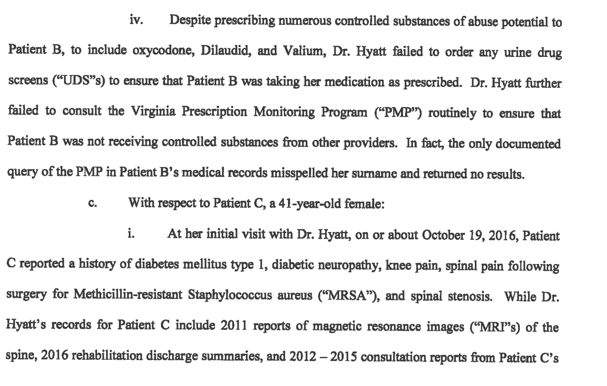

##From the License Lookup for Dr. Frank F Hyatt III, Alexandria, VA

License Number	0101048836
Occupation	Medicine & Surgery
Name	Frank F Hyatt III
Address	Alexandria, VA 22303
Initial License Date	12/01/1992
Expire Date	03/31/2020
License Status	Surrendered

##From Public Disciplinary Proceedings

BEFORE THE VIRGINIA BOARD OF MEDICINE
IN RE:	FRANK F. HYATT, HI, M.D.
License Number: 0101-048836
Case Numbers:	182299,177030,174309
CONSENT ORDER
JURISDICTION AND PROCEDURAL HISTORY
The Virginia Board of Medicine (“Board”) and Frank F. Hyatt, III, M.D., as evidenced by their signatures hereto, in lieu of proceeding to an informal conference, enter into the following Consent Order affecting Dr. Hyatt’s license to practice medicine and surgery in the Commonwealth of Virginia.
NOTICE
By letter dated January 10,2019, the Board sent a Notice of Informal Conference (“Notice”) to Dr. Hyatt notifying him that an informal conference would be held on March 7, 2019. The Notice was sent by UPS overnight mail to the legal address of record on file with the Board at the time of the mailing. By letter dated, January 28, 2019, the Board notified Dr. Hyatt that the informal conference was continued, and would be rescheduled for April 11,2019. This letter was sent by first class mail to the legal address of record at the time of the mailing, and to Dr. Hyatt’s counsel.
FINDINGS OF FACT AND CONCLUSIONS OF LAW
1.	Frank F. Hyatt, III, M.D., was issued License Number 0101-048836 to practice medicine and surgery on December 1,1992, which is scheduled to expire on March 31,2020.
2.	Frank F. Hyatt, III, M.D., violated Virginia Code §§ 54.1-2915.A(3), (8), (12), (13), (16), (17), and (18), 54.1-3303.A, and 54.1-3408.A and 18 VAC 85-20-26(C) of the Regulations Governing Medicine, Osteopathic Medicine, Podiatry and Chiropractic in his care and treatment of Patients A, B, C, E, F, G, and J, for complaints of chronic pain. Specifically:
a.	With respect to Patient A, a 58-year-old female:
i.	At her initial visit with Dr. Hyatt, on or about May 20. 2016. Patient A reported a history of both osteo- and rheumatoid-arthritis in both shoulders and knees, and temporomandibular joint (‘TMJ”) syndrome. However, Dr. Hyatt’s records for Patient A fail to include any laboratory or radiologic studies, or prior treatment records, to confirm such diagnoses.
ii.	After only performing a cursory examination of Patient A, Dr. Hyatt prescribed oxycodone (C-II) 30mg two tablets three times per day, temazepam (C-IV) 15mg one tablet at night, and gabapentin (C-VI) 300mg two tablets twice daily to treat her complaints of pain.
iii.	On or about June 15, 2016, Dr. Hyatt documented that Patient A would be seen at a university medical center for possible knee and shoulder surgeries; however, Dr. Hyatt’s records fail to reflect any coordination of care or consultation with such providers, and Dr. Hyatt continued to prescribe controlled substances for treatment of Patient A’s complaints of pain until on or after December 28, 2016, when he issued two prescriptions for oxycodone 30mg #168, which Patient A filled on or about January 2,2017, and January 5,2017.
b.	With respect to Patient B, a 49-year-old female:
i.	At her initial visit with Dr. Hyatt, on or about September 29, 2016, Patient B reported a history of migraines, hepatitis, arthritis, and asthma. However, Dr. Hyatt’s records for Patient B fail to include any laboratory or radiologic studies, or prior treatment records, to confirm such diagnoses.
ii.	At her initial visit. Dr. Hyatt documented that Patient B suffered from posterior neck pain and lumbar degenerative disc disease at L4-L5; and that she had suffered a “nervous breakdown” “this year”, for which she was prescribed Doxepin and Zyprexa. Without consulting with any of Patient B’s other treating providers, Dr. Hyatt prescribed oxycodone 15mg four times per day, Dilaudid (C-H) 4mg twice per day, Valium (C-IV) 5mg three times per day, and gabapentin 300mg three times per day to treat Patient B’s complaints of pain.
iii.	At her initial visit, Patient B reported that she was taking Prozac 20mg daily, and was not depressed. At her next visit with Dr. Hyatt, on or about October 24,2016, Patient B reported that the Prozac was not helping her depression. Without consulting with any other treatment providers, and without referring Patient B to another treatment provider for a higher level of care, Dr. Hyatt began prescribing citalopram 20mg daily. On or about December 19, 2016, Patient B expressed dissatisfaction with citalopram, and Dr. Hyatt began prescribing duloxetine 30mg twice daily. On or about January 12, 2017, Patient B expressed dissatisfaction with duloxetine and Dr. Hyatt resumed prescribing citalopram, but increased the dosage to 40mg daily, without documenting the justification for his medical decision-making.
iv.	Despite prescribing numerous controlled substances of abuse potential to Patient B, to include oxycodone, Dilaudid, and Valium, Dr. Hyatt failed to order any urine drug screens (“UDS”s) to ensure that Patient B was taking her medication as prescribed. Dr. Hyatt further failed to consult the Virginia Prescription Monitoring Program (“PMP”) routinely to ensure that Patient B was not receiving controlled substances from other providers. In fact, the only documented query of the PMP in Patient B’s medical records misspelled her surname and returned no results.
c.	With respect to Patient C, a 41 -year-old female:
i.	At her initial visit with Dr. Hyatt, on or about October 19,2016, Patient C reported a history of diabetes mellitus type 1, diabetic neuropathy, knee pain, spinal pain following surgery for Methicillin-resistant Staphylococcus aureus (“MRSA”), and spinal stenosis. While Dr. Hyatt’s records for Patient C include 2011 reports of magnetic resonance images (“MRP’s) of the spine, 2016 rehabilitation discharge summaries, and 2012 - 2015 consultation reports from Patient C’s  
treating neurologist, Dr. Hyatt foiled to consult with any of Patient C’s current or former treating providers, or obtain current radiologic studies, before prescribing baclofen (C-VI) lOmg twice daily, methadone (C-TI) 15mg three times per day, and Dilaudid 8mg four times per day.
ii.	Despite Patient C’s multiple medical problems and reports of concurrent treatment by other physicians (for partial amputations of toes, diabetes, a cerebrovascular accident, etc.), Dr. Hyatt failed to consult or coordinate his treatment with these physicians. Rather, Dr. Hyatt continued to prescribe Dilaudid and methadone to Patient C on or after December 21, 2016, without taking any steps to ensure Patient C’s compliance with his treatment regime, including review of the PMP or UDSs.
d.	On or about June 9, 2016, at her first visit with Dr. Hyatt, Patient E, a 30-year- old female, reported that her current treating provider had reduced her dose of methadone from 40mg to 20mg. Without consulting this provider, or attempting to obtain any verification of Patient E’s reported bilateral wrist pain, Dr. Hyatt prescribed methadone lOmg three times per day and oxycodone 20mg three times daily to Patient E. Dr. Hyatt continued to prescribe methadone and oxycodone to Patient E until on or after January 2, 2017, despite repeatedly noting that her right wrist was not functioning well and she was considering surgery. Dr. Hyatt foiled to refer Patient E to any specialists for such surgery, or consult with any physicians already treating Patient E for the same. Further, Dr. Hyatt failed to address Patient E’s UDS on or about November 10, 2016, which tested positive for opiates, when Dr. Hyatt was not prescribing any such medication to Patient E.
e.	At her initial office visit with Dr. Hyatt, on or about May 18,2016, Patient F, a 33-year-old female, reported prior lumbar disc surgery and low back pain radiating down both legs, lower abdominal pain from adhesions and endometriosis, and left upper quadrant abdominal pain from pancreatitis. Patient F reported taking methadone lOmg twice daily, oxycodone 15mg five times per day, and Dilaudid 4mg five times per day. Without obtaining any prior treatment records, consulting with any prior treatment providers, or performing or obtaining any diagnostic studies, Dr. Hyatt diagnosed Patient F with failed lumbar disc surgery, endometriosis, and pancreatitis, and prescribed methadone lOmg twice daily, oxycodone 15mg five times per day, Dilaudid 4mg five times per day, and gabapentin 300mg, up to 1200mg, daily.
f.	Between on or about June 5, 2013, and on or about April 6, 2016, Dr. Hyatt treated Patient G, a 32-year-old male for lumbar pain by prescribing Subutex (C-HI) 2mg three times daily, and oxycodone 15mg three times daily. Dr. Hyatt failed to obtain any prior treatment records or diagnostic testing to confirm Patient G’s purported diagnoses, and Dr. Hyatt failed to take appropriate action when Patient G’s UDSs routinely tested negative for one, or both, of the prescribed substances. Rather, Dr. Hyatt accepted the patient’s explanations that he took an occasional “extra” oxycodone, then ran short before his next appointment; or that he (the patient) was confused by the instructions to take the medication three times per day. Further, beginning in or about August 2015, Patient G began reporting that he intended to see a “spine specialist’ or “spine surgeon” “next month” or that an MRI “was scheduled.” Dr. Hyatt made no attempts to confirm the appointments and/or consult with this provider or obtain the results of any such diagnostic testing, and despite documenting mild tenderness and flexion to 60 - 80 degrees, Dr. Hyatt continued to prescribe the same strength and quantity of Subutex and oxycodone.
g.	With respect to Patient J, a 39-year-old female:
i.	At her first treatment visit with Dr. Hyatt, on or about May 26, 2016, Patient J reported that she had a “back fracture” in 2005,.2009, and had been doing well on Suboxone (C-III) twice daily for two years for back pain and opioid dependence. Without obtaining any prior treatment records, to include those for Patient J’s reported initial injury and her prior substance abuse  
treatment at Dr. Hyatt’s previous practice3, Dr. Hyatt began prescribing Suboxone 2mg twice daily to Patient J.
ii.	Between in or about May 2016 and in or about April 2017, Dr. Hyatt documented only one UDSs for Patient J, but frequently stated that she “got monthly UDS per court”. However, there is no indication Dr. Hyatt attempted to obtain copies of those records, or if he would be notified of aberrant test results. Also during this period, Patient J was a “no show” or rescheduled five treatment visits with Dr. Hyatt.
iii.	On or about August 8, 2017, Dr. Hyatt ordered a UDS for Patient J, which was positive for amphetamines. Dr. Hyatt failed to confront Patient J about this unexpected result until on or about September 5, 2017, at which time she stated she had taken some outdated medications from another physician. Dr. Hyatt took no further action regarding Patient J, who failed to show for her scheduled treatment visits with Dr. Hyatt in October or November 2017, which had to be rescheduled.
h.	Dr. Hyatt’s failed to maintain accurate, legible, and complete records for these patients, in that his handwritten notes are frequently illegible, and he failed to obtain complete medical and psychiatric histories, including substantiation of reported diagnoses, prior to prescribing controlled substances of significant abuse potential.
i.	Dr. Hyatt failed to utilize consistently measures to ensure that prescribed controlled substances were being taken as directed, to include medication contracts, UDSs, and reviews of the PMP. Although Dr. Hyatt included medication contract forms in several patient records, these forms frequently contained only the name and signature of the patient, without a list of the drugs, dosages, directions, or quantity to be prescribed, and without the name of the pharmacy at which patients would be presenting prescriptions. Further, Dr. Hyatt failed to update these contracts when he modified the drugs, dosages, directions, or quantities to be prescribed. When UDS results were included in patients’ medical records, they were typically handwritten, along with patient vital signs, and often difficult to interpret, particularly with regard to the substances for which the sample was tested.
j.	In a written statement to a Senior Investigator for the Virginia Department of Health Professions (“Senior Investigator”), Dr. Hyatt stated that the morphine milligram equivalents (“MME”s) for his patients “are kept at or below 90, with a few exceptions for people in severe intractable pain, sometimes up to 150 never to 200.” In medical records submitted to the Senior Investigator, Dr. Hyatt has documented MMEs for Patient A of270, Patient C of263, Patient E of330, and Patient F of275, without documentation to justify such exorbitant dosages.
3.	Frank F. Hyatt, HI, M.D., violated Virginia Code §§ 54.1-2915.A(3), (12), (13), (16), (17), and (18), 54.1-3303A, and 54.1-3408A and 18 VAC 85-20-26(C) of the Regulations Governing Medicine, Osteopathic Medicine, Podiatry and Chiropractic in his treatment of Patient D, a 47-year-old female, for opioid dependence and anxiety. Specifically, at her first office visit with Dr. Hyatt, Patient D’s UDS was positive for buprenorphine, oxycodone, and benzodiazepines, despite reporting to Dr. Hyatt that she was only taking Suboxone and Paxil (C-VT), and had “switched” from Vicodin (C-H) to Suboxone approximately eight years prior. Dr. Hyatt foiled to discuss this discrepancy with Patient C and prescribed Suboxone film 8mg/2mg twice daily. In conjunction with her treatment with Suboxone, Dr. Hyatt failed to provide counseling in his practice, or refer Patient C to mental health service providers. Rather, Dr. Hyatt noted that Patient C “attends meetings”.
4.	Frank F. Hyatt, in, M.D., violated Virginia Code §§ 54.1-2915A(3), (12), (13), (16), (17), and (18), 54.1-3303.A, and 54.1-3408A and 18 VAC 85-20-26(C) of the Regulations Governing Medicine, Osteopathic Medicine, Podiatry and Chiropractic in his treatment of Patient E’s purported attention-deficit hyperactivity disorder (“ADHD”) and hypertension. Specifically, at Patient E*s second treatment visit, on or about July 6 2016, Dr. Hyatt documented that Patient E had no history of hypertension, despite a blood pressure of 154/106 mmHg in June 2016 and 180/106 mmHg at that visit. At the July treatment visit, Dr. Hyatt also documented that Patient E had ADHD since childhood, and prescribed Adderall 20mg twice daily. On or about August 1, 2016, Dr. Hyatt prescribed Adderall 20mg three times per day to Patient E, but stated that she would have to receive such prescriptions from her psychiatrist thereafter. However, Dr. Hyatt continued to prescribe Adderall to Patient E until on or after January 2, 2017, without ever confirming her reported diagnosis or consulting with her purported psychiatrist. Further, despite a recorded blood pressure of 150/50 mmHg in August 2016, Dr. Hyatt failed to begin treating Patient E’s hypertension until on or about September 20, 2016, when her blood pressure was 156/100 mmHg, by prescribing lisinopril/hydrochlorothiazide 20mmg/25mg daily, without first attempting monotherapy.
5.	Frank F. Hyatt, ID, M.D., violated Virginia Code § 54.1-2915.A(3), (12), (13), (16), (17), and (18) and 18 VAC 85-20-90 of the Regulations Governing the Practice of Medicine, Osteopathy, Podiatry and Chiropractic in his prescribing of phentermine (C-IV) for weight loss to Patients H and I. Specifically:
a.	Dr. Hyatt failed to perform and record an appropriate history and physical examination of each patient prior to the initiation of pharmacology for weight loss, nor did he obtain or review laboratory work, including for thyroid function.
b.	Dr. Hyatt failed to obtain and/or review the results of an performed and interpreted electrocardiogram within ninety (90) days of initiating pharmacology for weight loss.
c.	Dr. Hyatt failed to prescribe and record a diet and exercise program for each patient receiving pharmacology for weight loss. 
d.	Dr. Hyatt failed to reevaluate and modify his treatment plan for Patient H when she reported weight gains, failure to take medication as prescribed, failure to follow her “diet,” which consisted of instructions to eat less than 1200 calories per day, by consuming primarily “Atkins shakes” and “Lean Cuisine”.
e.	Dr. Hyatt failed to reevaluate and modify his treatment plan for Patient I when she reported weight gains, despite treadmill exercise five times per week and a diet of 1200 - 1400 calories per day.
6.	Frank F. Hyatt, III, M.D., violated Virginia Code §§ 54.1-2915.A(12), (13), (16), (17), and (18), 54.1-3303.A, and 54.1-3408A and 18 VAC 85-20-25 of the Regulations Governing Medicine, Osteopathic Medicine, Podiatry and Chiropractic in that he prescribes digoxin (C-VI) and warfarin (C-VI) to himself for atrial fibrillation, without maintaining a medical record or documenting ongoing monitoring to ensure therapeutic levels of the drugs are maintained.
7.	Frank F. Hyatt, in, M.D., reported that he intends to retire from the active practice of medicine on or about March 31,2019.
CONSENT
Frank F. Hyatt, III, M.D., by affixing his signature to this Consent Order, agrees to the following:
1.	I have been advised to seek advice of counsel prior to signing this document and am represented by Anisa P. Kelley, Esquire;
2.	Iam fully aware that without my consent, no legal action can be taken against me or my license except pursuant to the Virginia Administrative Process Act, Virginia Code § 2.2-4000 et seq
3.	I acknowledge that I have the following rights, among others: the right to an informal fact-finding conference before the Board; and the right to representation by counsel; 
4.	I waive my right to an informal conference;
5.	I neither admit nor deny the Findings of Fact and Conclusions of Law contained herein but waive my right to contest such Findings of Fact and Conclusions of Law and any sanction imposed hereunder in any future judicial or administrative proceeding in which the Board is a party;
6.	I consent to the entry of the following Order affecting my license to practice medicine and surgery in the Commonwealth of Virginia.
ORDER
Based on the foregoing Findings of Fact and Conclusions of Law, the Virginia Board of Medicine hereby accepts the VOLUNTARY PERMANENT SURRENDER of the license of Frank F. Hyatt, III, M.D. to practice medicine and surgery in the Commonwealth of Virginia. This action shall become effective April 1, 2019. Dr. Hyatt shall not seek reinstatement of his license to practice medicine and surgery at any future date.
It is further ORDERED that immediately upon entry of this Consent Order, Dr. Hyatt shall cooperate with other practitioners to ensure continuation of treatment in conformity with the wishes of the patient.
Pursuant to Virginia Code §§ 2.2-4023 and 54.1-2400.2, the signed original of this Order shall remain in the custody of the Department of Health Professions as a public record, and shall be made available for public inspection and copying upon request.
