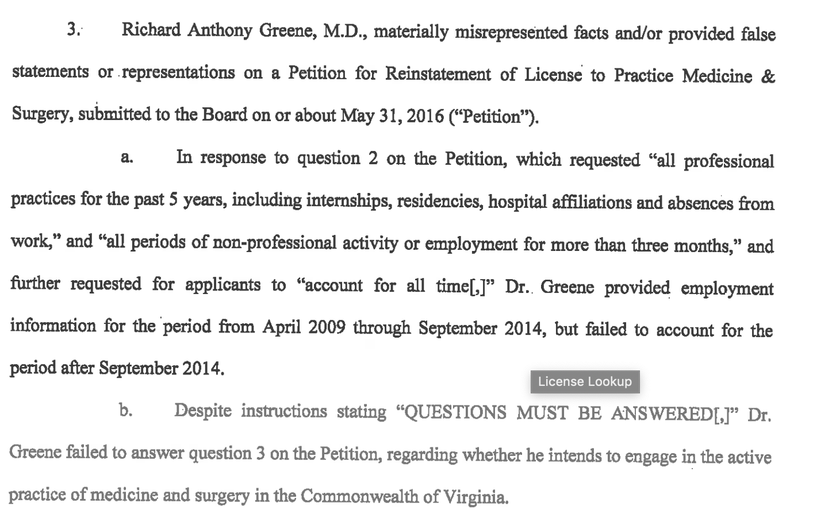

##From the License Lookup for Dr. Richard A Greene of Chesapeake, VA

License Number	0101246196
Occupation	Medicine & Surgery
Name	Richard A Greene
Address	Chesapeake, VA 23320
Initial License Date	08/03/2009
Expire Date	05/16/2014
License Status	Suspended

##From Public Disciplinary Proceedings

BEFORE THE VIRGINIA BOARD OF MEDICINE
IN RE:	RICHARD ANTHONY GREENE, M.D., REINSTATEMENT APPLICANT
LicenseNumber:	0101-246196
Case Number:	177794
ORDER
JURISDICTION AND PROCEDURAL HISTORY
Pursuant to Virginia Code §§ 2.2-4020,2.2-4024(F), and 54.1-2400(11), a panel of the Virginia Board of Medicine (“Board”) held a formal administrative hearing on February 15, 2019, in Henrico County, Virginia, to receive and act upon the petition for reinstatement of the license of Richard Anthony Greene, M.D., to practice medicine and surgery in the Commonwealth of Virginia and to inquire into evidence that grounds exist to deny said application.
Richard Anthony Greene, M.D., appeared at this proceeding and was not represented by legal counsel.
Upon consideration of the evidence, the Board adopts the following Findings of Fact and Conclusions of Law and issues the Order contained herein.
FINDINGS OF FACT
1.	On August 3, 2009, the Board issued License Number 0101-246196 to Richard Anthony Greene, M.D. to practice medicine and surgery in the Commonwealth of Virginia. Said license was indefinitely suspended by Consent Order of the Board, entered May 16,2014.
2.	Richard Anthony Greene, M.D., is incompetent to practice medicine and represents a danger to patients and the public. Specifically, he last practiced medicine in or about September 2014. Further, Dr. Greene has a documented history of incompetence, beginning in medical school, continuing into his residency, and culminating in a Consent Order of the Board, entered May 16,2014, which indefinitely suspended his license to practice medicine and surgery in the Commonwealth based on findings of negligent and dangerous patient care.
3.	Richard Anthony Greene, M.D., materially misrepresented facts and/or provided false statements or representations on a Petition for Reinstatement of License to Practice Medicine & Surgery, submitted to the Board on or about May 31,2016 (“Petition”).
a.	In response to question 2 on the Petition, which requested “all professional practices for the past 5 years, including internships, residencies, hospital affiliations and absences from work,” and “all periods of non-professional activity or employment for more than three months,” and further requested for applicants to “account for all time[,]” Dr. Greene provided employment information for the period from April 2009 through September 2014, but failed to account for the period after September 2014.
b.	Despite instructions stating “QUESTIONS MUST BE ANSWERED[J” Dr. Greene failed to answer question 3 on the Petition, regarding whether he intends to engage in the active practice of medicine and surgery in the Commonwealth of Virginia.
c.	In response to question 7 on the Petition, which asked “[h]ave you ever been suspended/revoked, denied privileges; ever voluntarily surrendered your clinical privileges; been censured or warned, or requested to withdraw from the staff of any medical school, residency or fellowship training, hospital, nursing home, or other health care facility, or health care provider/entity,” Dr. Greene answered “No”. However, information from credentials verifying services noted that Dr. Greene failed to complete a PGY-1 internship in internal medicine at Naval Medical Center, Portsmouth, Virginia, and had ten (10) months additional training under academic probation. Further, Dr. Greene’s “suboptimal and. unsatisfactory performance was noted within five (5) months of initiation of training, and his clinical privileges and residency training status ultimately were terminated due to inadequate competence.”
d.	In response to question 8 on the Petition, which asked if the applicant had “ever had any of the following disciplinary actions taken against your license to practice medicine, DEA permit, state controlled substances registration, Medicaid, and/or do you have any pending actions,”
Dr. Greene responded “Yes” and circled the letter next to suspension/revocation/surrender, but failed to provide any explanation or substantiation, despite the following actions:
i.	on or about May 27, 2015, the State Medical Board of Ohio revoked Dr. Greene’s certificate to practice in that jurisdiction, as a result of a Consent Order entered by the Virginia Board of Medicine on May 16,2014 (“2014 Consent Order”);
ii.	on or about February 25, 2015, the Board of Physicians for the State of Maryland suspended Dr. Greene’s license to practice in that jurisdiction, as a result of the 2014 Consent Order; and
iii.	on or about May 29, 2014, Dr. Greene voluntarily surrendered his registration to prescribe controlled substances, issued by the United States Drug Enforcement Administration.
e.	In response to Question 13 on the Petition, which asked “[d]o you have, or have you had, a physical disease, mental disorder, or any condition which could affect or has affected, your performance of professional duties,” Dr. Greene answered “No.” Yet, in an interview with a Senior Investigator for the Virginia Department of Health Professions, on or about January 19, 2017, Dr.
. Greene reported that he stopped working for an urgent care facility in the State of Maryland in or about September 2014, due to illness.
4.	The license/certificate of Richard Anthony Greene, M.D., to practice medicine has been restricted by other jurisdictions, as follows:
a.	on or about May 27, 2015, the State Medical Board of Ohio revoked Dr. Greene’s certificate to practice in that jurisdiction; and
b.	on or about February 27, 2015, the Board of Physicians for the State of Maryland suspended Dr. Greene’s license to practice in that jurisdiction.
5.	Richard Anthony Greene, M.D., took actions or made statements that are or were likely to deceive, defraud, or harm the public. 
a.	On or about September 16, 2015, when applying for employment with a healthcare, education and social services staffing company, Dr. Greene stated that he held a professional certificate as a doctor of medicine in the state of Ohio, which he represented expired January 2017. His certificate, however, had been revoked by Order of the State Medical Board of Ohio on or about May 27,2015.
b.	When he initially applied for a license to practice medicine and surgery in Virginia, Dr. Greene failed to disclose that he failed to complete his residency training at United States Naval Medical Center, Portsmouth, and that he was placed on academic probation. Further, Dr. Greene failed to disclose that between approximately June 1994 through approximately December 1998, while a student at Eastern Virginia Medical School, Norfolk, Virginia, Dr. Greene was placed in an academic remediation program.
6.	Dr. Greene did not meet his burden to demonstrate that he is safe and competent to resume the practice of medicine. Dr. Greene testified to the Board that, based on the record before the Board at the hearing, he was not competent to resume the practice of medicine.
CONCLUSIONS OF LAW
1.	Finding of Fact No. 2 constitutes a violation of Virginia Code § 54.1-54.1-2915(A)(4) and (13).
2.	Finding of Fact No. 3 constitutes a violation of Virginia Code §§ 54.1-2915(A)(1) and (16) and 54.1-111 (A)(6).
3.	Finding of Fact No. 4 constitutes a violation of Virginia Code § 54.1-2915(AX5).
4.	Finding of Fact No. 5 constitutes a violation of Virginia Code § 54.1 -2915(A)(16). 
ORDER
Based on the foregoing Findings of Fact and Conclusions of Law, the Virginia Board of Medicine hereby ORDERS that the petition of Richard Anthony Greene, M.D., for reinstatement of his license to practice medicine and surgery is DENIED. Further, it is ORDERED that the license be CONTINUED on INDEFINITE SUSPENSION. Should he petition the Board for reinstatement of his license, an administrative proceeding will be convened to determine whether Dr. Greene is able to return to the safe and competent practice of medicine and surgery. Dr. Greene shall be responsible for any fees that may be required for the reinstatement and/or renewal of the license prior to issuance of the license to resume practice.
Pursuant to Virginia Code §§ 2.2-4023 and 54.1-2400.2, the signed original of this Order shall remain in the custody of the Department of Health Professions as a public record, and shall be made available for public inspection and copying upon request.
