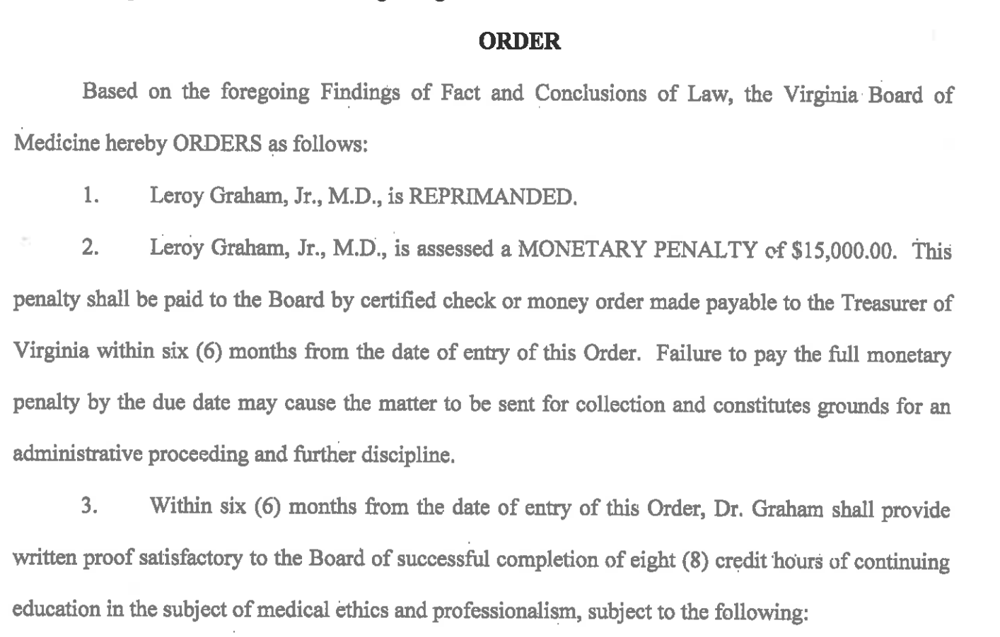

##From the License Lookup for Dr. Leroy Graham Jr, Newport News, VA

License Number	0101229881
Occupation	Medicine & Surgery
Name	Leroy Graham Jr.
Address	Newport News, VA 23608
Initial License Date	02/14/2001
Expire Date	04/30/2020
License Status	Current Active

##From Public Disciplinary Proceedings

BEFORE THE VIRGINIA BOARD OF MEDICINE
IN RE:	LEROY GRAHAM, JR., M.D.
License Number:	0101-229881
Case Number:	186607
ORDER
JURISDICTION AND PROCEDURAL HISTORY
Pursuant to Virginia Code §§ 2.2-4019 and 54.1-2400(10), a Special Conference Committee of the Virginia Board of Medicine (“Board”) held an informal conference on January 30, 2019, in Henrico County, Virginia, to inquire into evidence that Leroy Graham, Jr., M.D., may have violated certain laws and regulations governing the practice of medicine and surgery in the Commonwealth of Virginia.
Leroy Graham, Jr., M.D., appeared at this proceeding and was not represented by legal counsel.
Upon consideration of the evidence, the Committee adopts the following Findings of Fact and Conclusions of Law and issues the Order contained herein.
FINDINGS OF FACT AND CONCLUSIONS OF LAW
1.	Leroy Graham, Jr., M.D., was issued License Number 0101-229881 to practice medicine and surgery on February 14, 2001, which is scheduled to expire on April 30, 2020. At all times relevant to the findings contained herein, said license was current and active.
2.	Leroy Graham, Jr., M.D., violated Virginia Code § 54.1-2915.A(3), (11), (12), and (16) and 18 VAC 85-20-29.A(l) of the Regulations Governing the Practice of Medicine, Osteopathy, Podiatry, and Chiropractic (“Regulations”), in that, between in or about May 2017 until in or after February 2018, while serving as the medical director at a clinic in Woodbridge, Virginia, he aided and abetted the unlicensed practice of medicine, and allowed individuals to perform activities or functions that require the exercise of professional judgment. Specifically:
a.	In or about May 2017, Dr. Graham began serving as the “medical director” of a clinic offering treatment for neuropathy via electrostimulation therapy and stem cell therapy in Woodbridge, Virginia (“Clinic”), approximately 150 miles from his practice location. Since that time, Dr. Graham never visited the Clinic, never assessed or evaluated a patient at the Clinic, never communicated directly with any of the clinical staff (registered nurses, licensed nurse practitioners, physician assistants, etc.) at the Clinic, and never reviewed medical records for patients receiving treatment at the Clinic. Further, Dr. Graham allowed his medical license to be displayed in the Clinic and was listed as the Medical Director in the Clinic’s advertising materials. Dr. Graham advised the Committee that he did not fmd out that his license was displayed in the Clinic until he began to receive telephone calls from patients.
b.	Dr. Graham’s interactions with staff at the Clinic typically consisted of communications with the Clinic’s owner, Individual X, who was not a healthcare licensee, two (2) to four (4) times per month. Dr. Graham advised a Senior Investigator for the Virginia Department of Health Professions (“Investigator”) that he never met, worked, or communicated with any members of the Clinic’s clinical staff. Dr. Graham reviewed credentials of the clinical staff (e.g., resumes), and knew that there were “a couple of nurse practitioners there”, but he never entered into a collaborative agreement with any of the clinical staff, nor confirmed that the staff was practicing in accordance with the requirements of their respective licensing boards.
c.	Dr. Graham explained to the Committee that he was approached by Individual X at church, and asked to serve as the medical director of what Dr. Graham viewed as a franchise. Dr. Graham thought it meant he was serving in a consultant capacity, should any questions arise from the clinical staff. Dr. Graham did not believe he was hired to provide oversight for procedures, as he did not have any technical expertise in the offered procedures. Dr. Graham believed an “umbrella company,” located in Alabama, was providing necessary oversight and state-required collaborative and practice agreements to clinical staff. Dr. Graham does not recall receiving any calls from the clinical staff; however, he was occasionally in contact with Individual X, in church and by telephone. Dr. Graham believed he signed a contract to serve as the Clinic’s medical director, but was unable to locate a copy or recall details of such a contract.
d.	Dr. Graham confirmed that the Clinic was providing electrostimulation therapy and stem cell therapy for the treatment of neuropathy and arthritis, respectively. Dr. Graham admitted that he has not participated in any specialized training related to either therapy, and that he was aware that stem cell therapy has not been approved completely by the Food and Drug Administration (“FDA”), yet numerous patients, to include Patients A - F, received injections of purported stem cells by unlicensed and/or unsupervised individuals.
e.	Dr. Graham informed the Investigator that he believed “the patients were coming to the clinic with previously diagnosed neuropathy.” However, a review of records for six (6) patients at the Clinic revealed that all six (6) patients were self-referred, and the records for Patients A, B, C, and F failed to include any documentation from a physician to substantiate a diagnosis of peripheral neuropathy.
f.	Individual Y, a former registered nurse/licensed nurse practitioner at the Clinic, informed the Investigator that Dr. Graham made treatment decisions for patients at the Clinic; Dr. Graham ordered vitamin B-12 injections for patients; and Dr. Graham’s name was listed in the electronic medical record as the provider. Dr. Graham denied ever giving orders for vitamin B-12 injections, and stated that he does not order vitamin B-12 injections in his own practice, unless the patient is deficient.
g.	Individual Z, a registered nurse at the Clinic, informed the investigator that her duties included conducting neuropathy assessments on patients, applying the pads for electrostimulation, administering electrostimulation treatments “on the machine”, and administering injections of Vitamin B-12 and Marcaine to patients. Individual Z indicated that Individual X directed her on where to place the pads on the patient’s body, as well as the level of electrostimulation to be  
administered. Individual X informed Individual Z that he spoke with Dr. Graham in the evenings, and that Dr. Graham provided orders for the treatment to be provided. Dr. Graham denied the claims made by Individual Z, regarding Dr. Graham ordering any treatment at the Clinic.
3.	Dr. Graham advised the Committee that he did receive several telephone calls from patients at the Clinic, expressing concerns over the effectiveness of treatments provided and the financial arrangements for the treatments. Further, a few patients sought him out, in-person, at his office. Patients stated they were unable to contact Individual X. Dr. Graham did reach out to Individual X to follow-up on the patients’ concerns, but Dr. Graham did not ask to see patients’ charts or review their treatment at the Clinic.
4.	Dr. Graham stated to the Committee that he would do things differently in retrospect, and. ensured that he visited the Clinic regularly. Dr. Graham expressed sympathy for patients who were dissatisfied with treatments received at the Clinic, and who were frustrated by their inability to receive a response from Individual X regarding their concerns.
ORDER
Based on the foregoing Findings of Fact and Conclusions of Law, the Virginia Board of Medicine hereby ORDERS as follows:
1.	Leroy Graham, Jr., M.D., is REPRIMANDED.
2.	Leroy Graham, Jr., M.D., is assessed a MONETARY PENALTY of $15,000.00. this penalty shall be paid to the Board by certified check or money order made payable to the Treasurer of Virginia within six (6) months from the date of entry of this Order. Failure to pay the full monetary penalty by the due date may cause the matter to be sent for collection and constitutes grounds for an administrative proceeding and further discipline.
3.	Within six (6) months from the date of entry of this Order, Dr. Graham shall provide written proof satisfactory to the Board of successful completion of eight (8) credit hours of continuing education in the subject of medical ethics and professionalism, subject to the following: 
a.	The course(s) shall be approved in advance of registration by the Executive Director of the Board. Requests for approval must be received at least fifteen (15) business days prior to the course date.
b.	All continuing education hours/courses shall be completed through face-to-face, interactive sessions (i.e., no home study, journal, or Internet courses).
c.	Continuing education obtained through compliance with this term shall not be used toward licensure renewal.
Pursuant to Virginia Code §§ 2.2-4023 and 54.1-2400.2, the signed original of this Order shall remain in the custody of the Department of Health Professions as a public record, and shall be made available for public inspection and copying upon request.